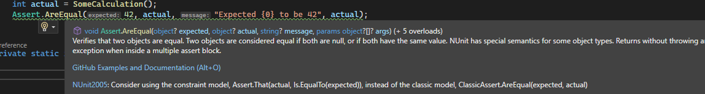
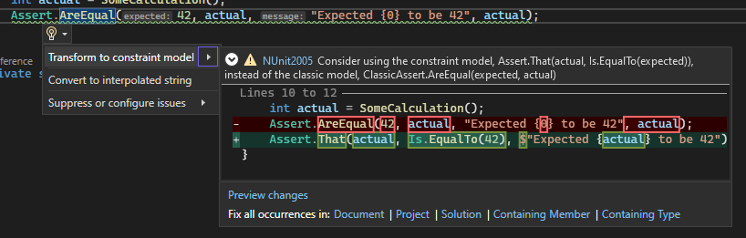
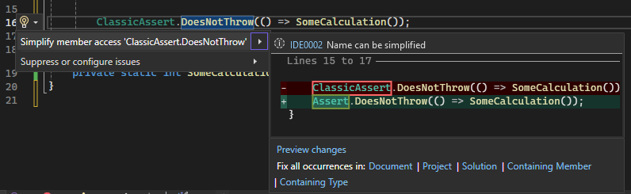
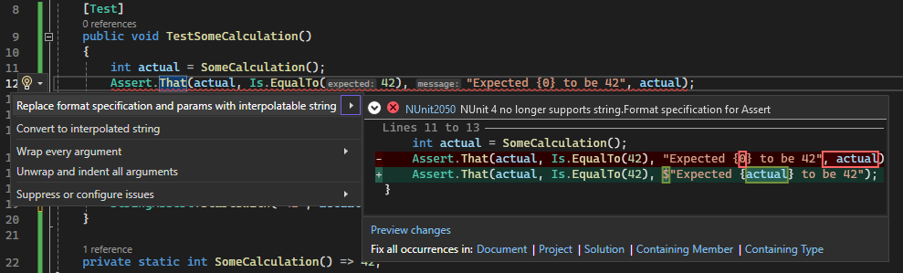

# Migration Guidance

## Compatibility

Ensure you use a compatible runner for NUnit Version 4.

| Runner | Minimum Version | Comments |
|------|---------------|--------|
| NUnit3TestAdapter | 4.5.0 | Used by Visual Studio and dotnet test|
| NUnit.Console | 3.15.5 | Note:  The 3.16.X series don't work with NUnit version 4|
| Rider/Resharper | 2023.3| Dec 5, 2023, is in EAP, due to release RSN |

## 3.x -> 4.x

NUnit 4.0 has a few [breaking changes](../release-notes/breaking-changes.md#nunit-40) making it neither binary nor
source code compatible with NUnit 3.14.0

* Change to [Classic Asserts](../writing-tests/assertions/assertion-models/classic.md)
* Removal of `Assert.That` overloads with _format_ specification and `params`.

### Classic Assert migration

There are different ways to migrate these to NUnit 4.0

* Convert Classic Assert to the [Constraint model](../writing-tests/assertions/assertion-models/constraint.md)
* Update source code to new namespace and class name
* Using `global using` aliases
  * In own source file
  * In project file or `Directory.Build.props`

In the sections below we use the following simple test as an example:

```csharp
public class Tests
{
    [Test]
    public void TestSomeCalculation()
    {
        int actual = SomeCalculation();
        Assert.AreEqual(42, actual, "Expected {0} to be 42", actual);
        StringAssert.StartsWith("42", actualText, "Expected '{0}' to start with '42'", actualText);
    }

    private static int SomeCalculation() => 42;
}
```

#### Convert Classic Assert to Constraint Model

Although the code can be converted manually, that is a lot of work.

Luckily, the [NUnit.Analyzer](https://www.nuget.org/packages/NUnit.Analyzers) has had rules and associated code fixes
for a while now. Version _3.10.0_ knows about the 2nd non-backward compatible change and will convert the _format_
specification and `params` into a `FormattableString`.

> [!NOTE]
> **Caveat**: The analyzers only run when the code compiles, so execute and act on the analyzer _before_
> upgrading `nunit` to version `4.0.0`!

In our example code, the analyzer will flag the `Assert.AreEqual` as shown below:



Running the associated `Transform to constraint model` code fix in Visual Studio will convert the code into:

```csharp
public class Tests
{
    [Test]
    public void TestSomeCalculation()
    {
        int actual = SomeCalculation();
        Assert.That(actual, Is.EqualTo(42), $"Expected {actual} to be 42");
    }

    private static int SomeCalculation() => 42;
}
```

The analyzer code fix supports _Batch Fixing_:



This allows changing all corresponding `Assert` usages for a document, project or a complete solution.

There are many classic asserts and most of these come with a separate code analyzer rule and code fix. Although it
allows full configuration to what classic asserts to keep or convert, it means that a developer has to repeat this
process multiple times, once for each assert method.

NUnit.Analyzer also has code fixers for `CollectionAssert` and `StringAssert`.

```csharp
string actualText = actual.ToString();
StringAssert.StartsWith("42", actualText, "Expected '{0}' to start with '42'", actualText);
```

Will be converted into:

```csharp
string actualText = actual.ToString();
Assert.That(actualText, Does.StartWith("42"), $"Expected '{actualText}' to start with '42'");
```

There are no code fixers for `FileAssert` and `DirectoryAssert`. They could be added, but we don't expect these to be
used too much.

Should you be migrating a larger number of repositories to the constraint model 
the following script can be used as a good starting point:

```bash
#!/bin/bash

# This script automates the process of adding and configuring the NUnit.Analyzers package to .NET projects.
# It performs the following steps:
# - Checks if a directory is provided as an argument, and defaults to the current directory if not.
# - Changes to the target directory to ensure all operations are performed within the correct git repository.
# - Creates a dedicated branch that will contain the changes
# - Searches for Directory.Packages.props in the target directory and its subdirectories.
#   - Fails the script when multiple are found
#   - If one is found it adds the NUnit.Analyzer there and makes sure the modifications to the project files follow the nomenclature
#     for centralized packages
# - Searches for all .csproj files in the target directory.
# - For each .csproj file:
#   - Checks if NUnit.Analyzers is already referenced, skipping if it is.
#   - Adds NUnit.Analyzers after the NUnit reference if not already present.
#   - Skips the .csproj file if no NUnit reference is found.
# - Stages the modified .csproj and/or Directory.Packages.props files for commit and prompts the user to review before committing.
# - Restores NuGet packages for all .sln files found in the directory.
# - Applies each diagnostic rule sequantially to the projects in parallel:
#   - Checks for NUnit.Analyzers reference, and creates or modifies .editor_config for each .csproj file.
#   - Applies the formatting using dotnet format for each diagnostic.
#   - Discards or deletes changes to .editor_config.
#   - Commits the changes for each diagnostic.
# - Returns to the original directory after completing the operations.
#
# Usage:
# chmod +x nunit-analyzer-automation.sh
# ./nunit-analyzer-automation.sh target/directory/path
#
# Requirements:
# - sed
# - git
# - gh
#
# Installation Requirements MacOS: 
# - brew install gnused
#   - Make it the default sed as outlined in the hints in the installation step of the brew package or replaced "sed" with "gsed" in the script in case you don't want to override the default sed of MacOS
# - brew install gh
#   - gh auth login
#     The gh client needs to be authenticated
#   - gh auth refresh -s project
#     The gh client requires project scope

# Check if a directory is provided as an argument, if not, use the current directory
TARGET_DIR="${1:-.}"

PACKAGE_NAME="NUnit.Analyzers"
PACKAGE_VERSION="4.3.0"  # Replace with the desired version
BRANCH_NAME="nunit-assertions-migration"
PROJECT_ID="XXX"
ORG="ZZZ"

# Define the XML snippet to insert
INSERT_SNIPPET_CSPROJ="    <PackageReference Include=\"$PACKAGE_NAME\" Version=\"$PACKAGE_VERSION\" />"
INSERT_SNIPPET_CSPROJ_PROPS="    <PackageReference Include=\"$PACKAGE_NAME\" />"
INSERT_SNIPPET_PROPS="    <PackageVersion Include=\"$PACKAGE_NAME\" Version=\"$PACKAGE_VERSION\" />"

# Change to the TARGET_DIR to ensure all commands are executed in the context of its git repository
pushd "$TARGET_DIR" || { echo "Failed to change directory to $TARGET_DIR"; exit 1; }

git checkout -b $BRANCH_NAME

# Find all Directory.Packages.props files in the target directory and its subdirectories
prop_files=($(find . -name "Directory.Packages.props"))
prop_file=

# Check if there are multiple Directory.Packages.props files
if [ ${#prop_files[@]} -gt 1 ]; then
    echo "Error: Multiple Directory.Packages.props files found. The script cannot proceed."
    exit 1
elif [ ${#prop_files[@]} -eq 1 ]; then
    prop_file="${prop_files[0]}"
    echo "Found Directory.Packages.props: $prop_file"
    # Check if the project already has NUnit.Analyzers
    if grep -qi "<PackageVersion Include=\"$PACKAGE_NAME\"" "$prop_file"; then
        echo "Skipping $prop_file - $PACKAGE_NAME already present"
    else
        echo "Adding $PACKAGE_NAME to $prop_file"
        # Insert the PackageReference after the NUnit reference to preserve the item groups that got added
        sed -i "/<PackageVersion Include=\"NUnit\"/Ia\\
$INSERT_SNIPPET_PROPS" "$prop_file"
        INSERT_SNIPPET_CSPROJ=$INSERT_SNIPPET_CSPROJ_PROPS
    fi
else
    echo "No Directory.Packages.props found"
fi

# Find all .csproj files in the target directory
find . -name "*.csproj" | while read -r csproj; do
    # Check if the project already has NUnit.Analyzers
    if grep -qi "<PackageReference Include=\"$PACKAGE_NAME\"" "$csproj"; then
        echo "Skipping $csproj - $PACKAGE_NAME already present"
    # Check if the project references NUnit and add NUnit.Analyzers if not already present
    elif grep -qi '<PackageReference Include="NUnit"' "$csproj"; then
        echo "Adding $PACKAGE_NAME to $csproj"
        
        # Insert the PackageReference after the NUnit reference to preserve the item groups that got added
        sed -i "/<PackageReference Include=\"NUnit\"/Ia\\
$INSERT_SNIPPET_CSPROJ" "$csproj"
    else
        echo "Skipping $csproj - No NUnit reference found"
    fi
done

# Stage .csproj files for commit
git add "*.csproj"
if [ -f "$prop_file" ]; then
    git add "$prop_file"
fi

echo "Verify the changes and do the necessary resets with git. For example test projects that are shipped should either not have the analzyer or the the PrivateAssets set to All. Hit any key to commit the staged files"
read -sn1

git commit -m "Add Nunit.Analyzer to test projects"

# Restore NuGet packages for all .sln files
find . -name "*.sln" | while read -r solution; do
    echo "Restoring nuget packages in $solution"
    dotnet restore $solution
done

nunit_analyzer_diagnostics=($(seq -f "NUnit%g" 2001 2050))
# For manual purposes use the explicitely declared diagnostic IDs
# nunit_analyzer_diagnostics=(
#   "NUnit2001" "NUnit2002" "NUnit2003" "NUnit2004" "NUnit2005"
#   "NUnit2006" "NUnit2007" "NUnit2008" "NUnit2009" "NUnit2010"
#   "NUnit2011" "NUnit2012" "NUnit2013" "NUnit2014" "NUnit2015"
#   "NUnit2016" "NUnit2017" "NUnit2018" "NUnit2019" "NUnit2020"
#   "NUnit2021" "NUnit2022" "NUnit2023" "NUnit2024" "NUnit2025"
#   "NUnit2026" "NUnit2027" "NUnit2028" "NUnit2029" "NUnit2030"
#   "NUnit2031" "NUnit2032" "NUnit2033" "NUnit2034" "NUnit2035"
#   "NUnit2036" "NUnit2037" "NUnit2038" "NUnit2039" "NUnit2040"
#   "NUnit2041" "NUnit2042" "NUnit2043" "NUnit2044" "NUnit2045"
#   "NUnit2046" "NUnit2047" "NUnit2048" "NUnit2049" "NUnit2050"
# )

for diagnostic in ${nunit_analyzer_diagnostics[@]}; do
    echo "Applying rule $diagnostic"

    formatting_jobs=()

    while IFS= read -r csproj; do
        (
            # Check if the project already has NUnit.Analyzers
            if grep -q "<PackageReference Include=\"$PACKAGE_NAME\"" "$csproj"; then
                csproj_dir=$(dirname "$csproj")
                editor_config="$csproj_dir/.editorconfig"

                if [ ! -f "$editor_config" ]; then
                    echo "Creating .editor_config in $editor_config"
                    touch "$editor_config"
                    echo "[*.cs]" >> "$editor_config"
                fi

                echo "Appending to $editor_config"
                echo "dotnet_diagnostic.$diagnostic.severity = warning" >> "$editor_config"

                echo "Formatting $csproj with diagnostic $diagnostic"
                dotnet format analyzers $csproj --diagnostics $diagnostic --severity info --no-restore --verbosity diagnostic

            else
                echo "Skipping $csproj - No NUnit.Analyzer reference found"
            fi
        ) &
        
        formatting_jobs+=($!)
    done < <(find . -name "*.csproj")

    echo "Waiting for formatting jobs to complete"
    for formatting_job in "${formatting_jobs[@]}"; do
        wait $formatting_job
    done

    echo "Committing formatting changes"
    git add "*.cs"
    git commit -m "Autoformat of test projects for $diagnostic"

    echo "Discarding all unrelated changes"
    git reset --hard
    git clean -f

    formatting_jobs=()
done

echo "Pushing the branch upstream"
git push --set-upstream origin $BRANCH_NAME

echo "Creating the pull request"
pull_request_url=$(gh pr create --title "Migrate NUnit assertions to the constraint model in preparation of the NUnit 4 upgrade" --body "
This PR contains all changes related to assertion model according to the [constraint assertion model](https://docs.nunit.org/articles/nunit/writing-tests/assertions/assertion-models/constraint.html).

Using a script, we apply all [assertion rules](https://docs.nunit.org/articles/nunit-analyzers/NUnit-Analyzers.html#assertion-rules-nunit2001---) provided by the NUnit.Analyzers package. In addition, some manual interventions are done when applicable.

## Plan of action

- [ ] ⚠️ Build the solution and resolve any remaining errors or warnings
- [ ] ✅ Review the assertions commit by commit
- [ ] 👀 Invite another pair of eyes to re-review
" --assignee "@me" --head $BRANCH_NAME)

gh project item-add $PROJECT_ID --owner $ORG --url $pull_request_url
gh pr merge $pull_request_url --auto --squash

popd
```

The script is provided as is and might require further tweaks to the specific use cases. 
It was written assuming a few structural conventions that might not apply to every use case.

#### Updating from Classic Asserts in NUnit 4.x

If you want to keep the Classic Asserts and not convert them to the constraint model -- but do want to use the new NUnit
4.x naming -- you'll need to update the code manually.

The NUnit.Analyzer can't help here as the code either doesn't compile before the change or after, depending on what
version of `nunit` you are compiling with.

If you _only_ use classic asserts, you can get away with a couple of global substitutes:

1. Convert `using NUnit.Framework;` into _both_ `using NUnit.Framework;using NUnit.Framework.Legacy;`

   Depending on your editor you can automatically insert a newline between the two `using` statements.
1. Convert `Assert` into `ClassicAssert`.

   This global substitute will also convert those asserts that have not changed. You can narrow the scope of this
substitute to do only the asserts that need converting, but there are quite a lot.

   1. Convert `Assert.AreEqual` into `ClassicAssert.AreEqual`.
   1. Convert `Assert.True` into `ClassicAssert.True`.
   1. Similar for `IsTrue`, `False`, `IsFalse`, `Greater`, `Less`, ...

   Depending on what is less work, alternatively you can reverse the substitution of those that shouldn't have been
   changed:
   1. Convert `ClassicAssert.That` into `Assert.That`.
   1. Convert `ClassicAssert.Fail` into `Assert.Fail`.
   1. Convert `ClassicAssert.Throws` into `Assert.Throws`.
   1. Etc.

   Or if you use Visual Studio, it will raise an
   [IDE0002](https://learn.microsoft.com/en-us/dotnet/fundamentals/code-analysis/style-rules/ide0002) with a code fix
   that can convert all of those that are not considered _classic_ back to assert in one swoop:

   

#### Use `global using` aliases

If you use SDK 6.0 or newer that supports C#10, you can upgrade without modifying any actual tests by adding the
following aliases to `GlobalUsings.cs`

```csharp
global using Assert = NUnit.Framework.Legacy.ClassicAssert;
global using CollectionAssert = NUnit.Framework.Legacy.CollectionAssert;
global using StringAssert = NUnit.Framework.Legacy.StringAssert;
global using DirectoryAssert = NUnit.Framework.Legacy.DirectoryAssert;
global using FileAssert = NUnit.Framework.Legacy.FileAssert;
```

Note that this doesn't mean you have to target .NET 6.0. This also works if targeting .NET Framework as it is purely
done on the source code level.

If you have to do this for multiple projects in a repository, this is not handy.
It seems [somebody else thought of that](https://github.com/dotnet/msbuild/issues/6745) and
it is now possible to add global usings in a
[`Directory.Build.props`](https://learn.microsoft.com/en-us/visualstudio/msbuild/customize-by-directory?view=vs-2022#directorybuildprops-and-directorybuildtargets)
file which will be used by all projects in a repository:

```xml
<ItemGroup>
  <Using Include="NUnit.Framework.Legacy.ClassicAssert" Alias="Assert" />
  <Using Include="NUnit.Framework.Legacy.CollectionAssert" Alias="CollectionAssert" />
  <Using Include="NUnit.Framework.Legacy.StringAssert" Alias="StringAssert" />
  <Using Include="NUnit.Framework.Legacy.DirectoryAssert" Alias="DirectoryAssert" />
  <Using Include="NUnit.Framework.Legacy.FileAssert" Alias="FileAssert" />
</ItemGroup>
```

The build process now automatically creates a `${Project}.GlobalUsings.g.cs` file
for each project with a contents similar to the one shown above.

### Assert.That with _format_ specification and `params` overload conversion

These overloads were removed to allow for better messages in case of failure. See [The "Towards NUnit 4"
article](../Towards-NUnit4.md#improved-assert-result-messages) for more information.

NUnit 4.x has been optimized such that these formattable strings only get formatted in case the test is failing.

```csharp
int actual = SomeCalculation();
Assert.That(actual, Is.EqualTo(42), "Expected {0} to be 42", actual);
```

Needs to be converted into:

```csharp
int actual = SomeCalculation();
Assert.That(actual, Is.EqualTo(42), $"Expected {actual} to be 42");
```

To make this transition easier, the Nunit.Analyzer has been updated with a new rule and corresponding code-fix:



### Using NUnit Extension libraries

If your code doesn't call `nunit` asserts directly but uses a local `NUnitExtension` library or a 3rd party one then
that dependency needs to be upgraded _before_ you can upgrade your own code.

If the library is not NUnit 4.0 compliant, you will get error messages like:

```txt
System.MissingMethodException : Method not found: 'Void NUnit.Framework.Assert.That(!!0, NUnit.Framework.Constraints.IResolveConstraint, System.String, System.Object[])'.
```
