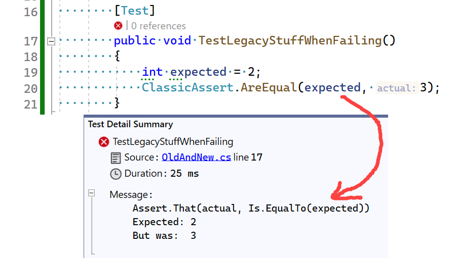

# Assertions

Assertions are central to unit testing in any of the xUnit frameworks, and NUnit
is no exception. NUnit provides a rich set of assertions as static methods of
the Assert class.

If an assertion fails, the method call does not return and an error is reported.
If a test contains multiple assertions, any that follow the one that failed
will not be executed. For this reason, it's usually best to try for one
assertion per test.

Each method may be called without a message, with a simple text message or with
a message with interpolated arguments (aka interpolated string).

## Two Models

In NUnit 3.0 and higher, assertions are written primarily using the `Assert.That` method,
which takes [constraint objects](xref:constraints) as an argument. We call this
the [Constraint Model](xref:constraintmodel) of assertions.

In earlier versions of NUnit, a separate method of the Assert class was used
for each different assertion. This [Classic Model](xref:classicmodel) is still supported but
since no new features have been added to it for some time, the constraint-based
model must be used in order to have full access to NUnit's capabilities.

For example, the following code must use the constraint model. There is no real classic equivalent.

[!code-csharp[ConstraintWithoutClassicEquivalent](~/snippets/Snippets.NUnit/ClassicVsConstraintAssertions.cs#ConstraintWithoutClassicEquivalent)]

Where equivalents do exist, the two approaches will always give the same result,
because the methods of the classic approach have all been implemented internally
using constraints. For example...

[!code-csharp[ClassicAndConstraintsAreEquivalent](~/snippets/Snippets.NUnit/ClassicVsConstraintAssertions.cs#ClassicAndConstraintsAreEquivalent)]

### Some notes on the Classic/Legacy asserts

The classic/legacy asserts, like `ClassicAssert.AreEqual`, have now been moved into its own project (namespace), and will later be released as a separate package.  They are now in the namespace `NUnit.Framework.Legacy`, and the `Assert` have been renamed to `ClassicAssert`.

If you're upgrading from NUnit 3.X to NUnit 4, you need to add a using for `NUnit.Framework.Legacy` to your test classes, and rename all classic asserts from `Assert` to `ClassicAssert`.

You can freely mix the constraint model assertions and the classic asserts in the same test class.

All assertions in the `ClassicAssert` class are rerouting to use the constraint model.

As shown in the example in [Towards NUnit 4](xref:towardsnunit4), error message have been enhanced so that you see the Assert expression.  This also works for the ClassicAsserts, but what you will see there is the equivalent constraint expression.

