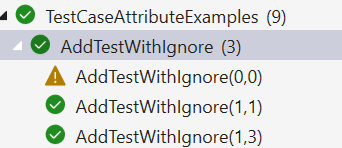
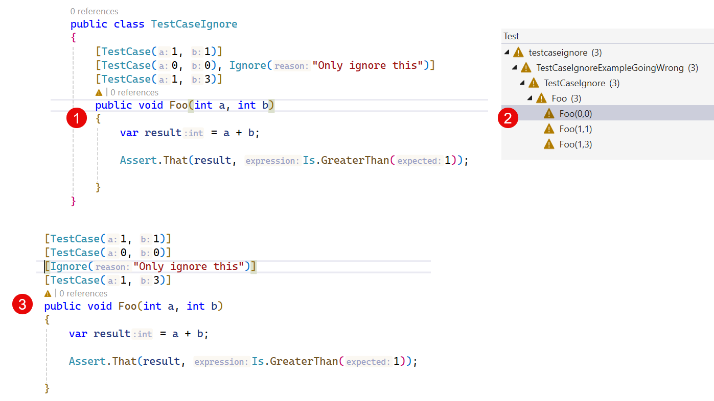

# TestCase

`TestCaseAttribute` marks a method with parameters as a test and supplies **inline arguments** for individual cases. You may apply the attribute multiple times to create several cases from one method.

[!code-csharp[BasicTestCase](~/snippets/Snippets.NUnit/Attributes/TestCaseAttributeExamples.cs#BasicTestCase)]

The three `[TestCase(...)]` lines above yield **three** invocations—one set of arguments per attribute.

> [!NOTE]
> Because arguments to .NET attributes are limited in terms of the types that may be used, NUnit attempts to convert literal values using `Convert.ChangeType()` before passing them into the method.

**`TestCaseAttribute`** may appear one or more times on a test method, which may also carry other data-providing attributes. Once **any** parameter has explicit data (`[TestCase]`, `[Values]`, `[Range]`, …), **every** parameter must have a data source—see [Parameterized Tests](xref:parameterizedtests). The method may optionally be marked with the [Test attribute](xref:testattribute) as well.

## Constructors

NUnit supplies arguments to the test method from the **positional** constructor parameters. You may repeat the attribute on the same method to provide multiple cases.

```csharp
TestCaseAttribute(params object?[]? arguments)
TestCaseAttribute(object? arg)
TestCaseAttribute(object? arg1, object? arg2)
TestCaseAttribute(object? arg1, object? arg2, object? arg3)
```

On **.NET 6+**, generic forms such as `TestCaseAttribute<T>` offer compile-time typed arguments (see **Generic TestCase Attributes** below).

Use **named parameters** on the attribute for per-case metadata (`ExpectedResult`, `Ignore`, `Explicit`, etc.).

## Applies To

| Test Methods | Test Fixtures (Classes) | Assembly |
|--------------|--------------------------|----------|
| ✅ | ❌ | ❌ |

## Expected result

When the method returns a value, `ExpectedResult` lets NUnit compare the return value instead of asserting inside the body:

[!code-csharp[TestCaseWithExpectedResult](~/snippets/Snippets.NUnit/Attributes/TestCaseAttributeExamples.cs#TestCaseWithExpectedResult)]

For those cases NUnit asserts that the **return value** equals the **`ExpectedResult`** specified on that attribute instance (rather than inspecting the attribute value inside the body).

## Named parameters overview

Beyond arguments and `ExpectedResult`, each `TestCase` can set metadata and filters:

| Named parameter | Role |
|-----------------|------|
| `Author` | Author metadata for this **case**. |
| `Category` | Comma-separated categories for this **case** only (not the whole fixture). |
| `Description` | Case description surfaced in runners and XML. |
| `ExcludePlatform` | Comma-separated platform identifiers to skip this case—see [Platform](xref:platformattribute). |
| `ExpectedResult` | Expected return value; method must declare a compatible return type. |
| `Explicit` | Makes this single case explicit; pair with **`Reason`** for messaging. |
| `Ignore` / `IgnoreReason` | Ignores just this case; both set the skip reason (**`Ignore`** is an alias setter). |
| `IncludePlatform` | Comma-separated identifiers where this **case** is allowed—see [Platform](xref:platformattribute). |
| `Reason` | Explanation for **`Explicit`** (or propagated as skip-reason metadata). |
| `TestName` | Custom template for this case display name—see [Template Based Test Naming](xref:templatebasedtestnaming). |
| `TestOf` | Documents the tested type (metadata only; not enforced by runners). |
| `TypeArgs` | Explicit generic type arguments (**NUnit 4.1+**). |
| `Until` | Time-boxed ignore; requires **`IgnoreReason`**—after the instant passes, the case runs normally (same rules as [`Ignore(..., Until = ...)`](xref:ignoreattribute)). |

Sections below reference **runnable** snippets for most switches. Some parameters (`Ignore`, `Explicit`, **`Category`**) are easy to misapply as **separate** attributes on the fixture—see **Naming collisions** after the examples.

### Description, `Author`, and `TestOf`

[!code-csharp[TestCaseWithDescriptionAuthorTestOf](~/snippets/Snippets.NUnit/Attributes/TestCaseAttributeExamples.cs#TestCaseWithDescriptionAuthorTestOf)]

### Include / exclude platforms

Per-case platform filters mirror the [Platform](xref:platformattribute) attribute. The sample uses **`ExcludePlatform`** so it keeps running on typical desktops; an `IncludePlatform` idea appears in a comment because it can legitimately skip hosts that lack a moniker:

[!code-csharp[TestCaseWithPlatforms](~/snippets/Snippets.NUnit/Attributes/TestCaseAttributeExamples.cs#TestCaseWithPlatforms)]

### Custom `TestName` templates

Use template tokens such as `{m}`, `{c}`, `{a}`, `{0}`—see [Template Based Test Naming](xref:templatebasedtestnaming):

[!code-csharp[TestCaseWithTestName](~/snippets/Snippets.NUnit/Attributes/TestCaseAttributeExamples.cs#TestCaseWithTestName)]

### `Ignore`, `Explicit`, and `Category` (named parameters)

> [!WARNING]
> `Ignore`, `Explicit`, and `Category` **must appear as named properties on `[TestCase(...)]`.** A separate `[Ignore]` / `[Explicit]` line still decorates the **entire fixture**. See **Naming collisions** below.

[!code-csharp[TestCaseWithIgnore](~/snippets/Snippets.NUnit/Attributes/TestCaseAttributeExamples.cs#TestCaseWithIgnore)]

[!code-csharp[TestCaseWithExplicit](~/snippets/Snippets.NUnit/Attributes/TestCaseAttributeExamples.cs#TestCaseWithExplicit)]

**`Reason`** is optional alongside `Explicit = true`; some runners omit or obscure explicit reasons—for example Visual Studio Test Explorer often does **not** show the explanatory text even when supplied.

[!code-csharp[TestCaseWithCategory](~/snippets/Snippets.NUnit/Attributes/TestCaseAttributeExamples.cs#TestCaseWithCategory)]

Putting **`[Category]`** on the fixture (or elsewhere on the test type) assigns categories to **all** tests under that fixture, whereas **`Category = "..."`** on `[TestCase]` scopes the category **to that generated case**.

### `Until` with `IgnoreReason`

`Until` follows the same constraints as [`Ignore(Until = ...)`](xref:ignoreattribute): **`IgnoreReason` is mandatory**—without it, NUnit marks the metadata invalid.

[!code-csharp[TestCaseWithIgnoreUntil](~/snippets/Snippets.NUnit/Attributes/TestCaseAttributeExamples.cs#TestCaseWithIgnoreUntil)]

### `TypeArgs` for generic test methods

Runtime type substitution works on [.NET Framework](https://learn.microsoft.com/dotnet/standard/frameworks) and modern [.NET](https://learn.microsoft.com/dotnet/core/introduction):

[!code-csharp[TestCaseWithTypeArgs](~/snippets/Snippets.NUnit/Attributes/TestCaseAttributeExamples.cs#TestCaseWithTypeArgs)]

### Choosing `TypeArgs` vs generic `[TestCase<…>]`

[!code-csharp[TypeArgsComparedToGenericAttribute](~/snippets/Snippets.NUnit/Attributes/TestCaseGenericExamples.cs#TypeArgsComparedToGenericAttribute)]

**`TypeArgs`** keeps samples working on **.NET Framework** hosts. **`[TestCase<int>(…)]`** (through five type parameters) needs **.NET 6+** generic attribute support (**NUnit 4.6+**).

## Naming collisions

Adding a **second** `[Ignore]` _attribute_ beside `[TestCase]` binds to the enclosing fixture—even if visually on the same or next line—as if you ignored the entire class.



The wrong layouts below show how easy it is to ignore the fixture by accident: _(1)_ an extra `[Ignore]` on the **same line** after `[TestCase]`, _(2)_ the fixture disappears as ignored tests, _(3)_ a separate `[Ignore]` line behaves the same as _(1)._



<!-- cspell:disable-next-line -->
_Thanks to [Geir Marius Gjul](https://github.com/GeirMG) for raising this question again._

## Order of Execution

Individual test cases are executed in the order in which NUnit discovers them. This order does **not** necessarily follow the lexical order of the attributes and will often vary between different compilers or different versions of the CLR.

As a result, when **TestCaseAttribute** appears multiple times on a method or when other data-providing attributes are used in combination with **TestCaseAttribute**, the order of the test cases is undefined.

## Generic TestCase Attributes

NUnit provides generic versions of `TestCaseAttribute` that offer compile-time type safety for test arguments. These are available as `TestCaseAttribute<T>` through `TestCaseAttribute<T1, T2, T3, T4, T5>`, supporting up to five type parameters.

> [!NOTE]
> From NUnit **4.6**, generic **`TestCase<>`** attributes require runtimes with generic attribute support (**not** classic **.NET Framework**). Use **`TypeArgs`** there instead.

### Single Type Parameter

[!code-csharp[GenericTestCaseSingleType](~/snippets/Snippets.NUnit/Attributes/TestCaseGenericExamples.cs#GenericTestCaseSingleType)]

### Multiple Type Parameters

[!code-csharp[GenericTestCaseTwoTypes](~/snippets/Snippets.NUnit/Attributes/TestCaseGenericExamples.cs#GenericTestCaseTwoTypes)]

### With Expected Result

Generic TestCase attributes support all the same named parameters as the regular `TestCaseAttribute`:

[!code-csharp[GenericTestCaseWithExpectedResult](~/snippets/Snippets.NUnit/Attributes/TestCaseGenericExamples.cs#GenericTestCaseWithExpectedResult)]

### Mixing Generic and Regular TestCase

You can mix generic and regular `TestCase` attributes on the same method:

[!code-csharp[GenericTestCaseMixedWithRegular](~/snippets/Snippets.NUnit/Attributes/TestCaseGenericExamples.cs#GenericTestCaseMixedWithRegular)]

### Benefits of Generic TestCase

* **Compile-time type checking**: Errors are caught at compile time rather than runtime
* **Better IDE support**: IntelliSense provides accurate parameter types
* **Clearer intent**: The expected types are explicit in the attribute declaration
* **Refactoring safety**: Type changes are caught by the compiler

## See Also

* [Test Attribute](xref:testattribute)
* [Values Attribute](xref:valuesattribute)
* [Range Attribute](xref:rangeattribute)
* [Random Attribute](xref:randomattribute)
* [Platform Attribute](xref:platformattribute)
* [Ignore Attribute](xref:ignoreattribute)
* [Explicit Attribute](xref:explicitattribute)
* [TestCaseSource Attribute](xref:testcasesourceattribute)
